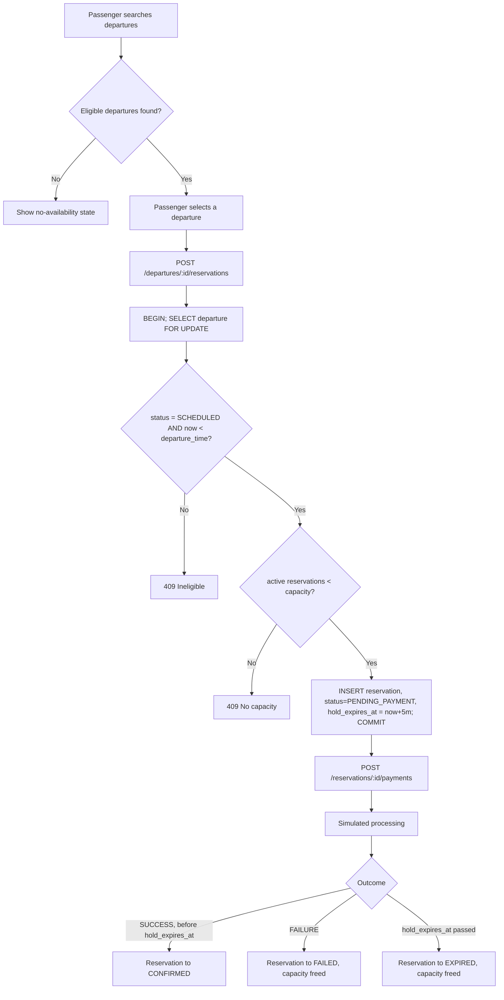
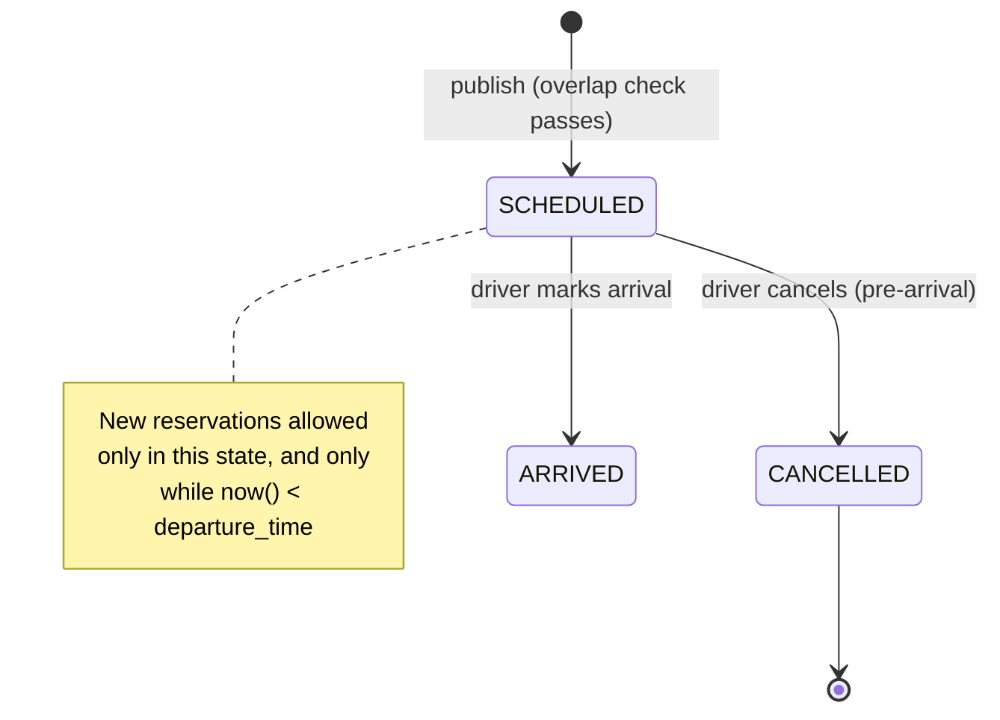
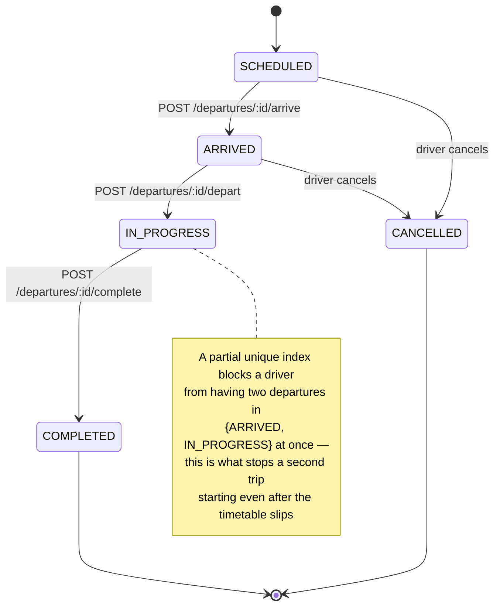
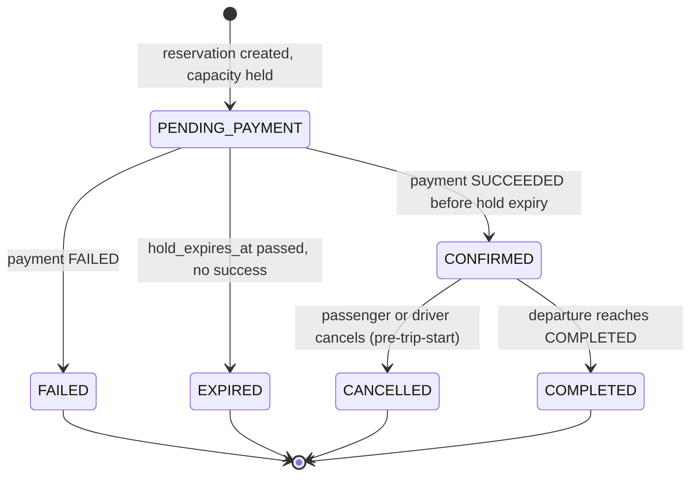
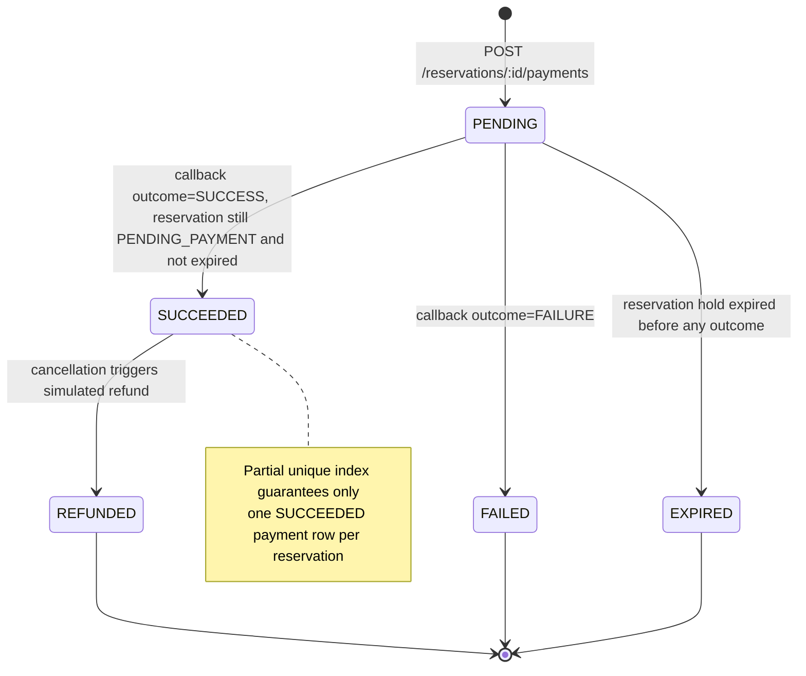
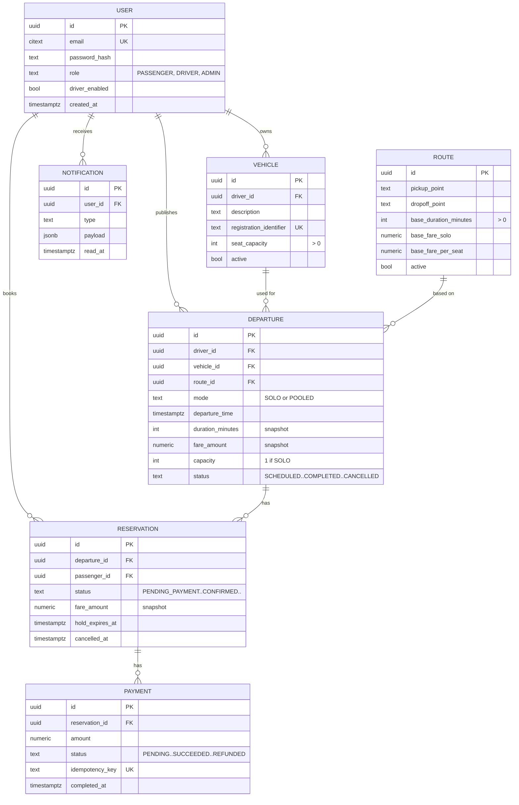

# Ride-Pooling Capstone — Week 1 Design Review

**Scope:** MM-01 through MM-08. Design only, no application code (one optional 1–2 day concurrency spike permitted). **Stack:** Express + TypeScript, PostgreSQL (hosted on Neon for development) + TypeORM, argon2, JWT, Zod, swagger-jsdoc, Jest/Supertest, Docker (deploy-time only — see Week 6).

Every place I made a call the spec didn't fully pin down was marked **Assumption:** below. All of them are now confirmed (see the summary at the end) — flag anything you want reopened.

---

## Foundational Design Decisions

These six decisions are load-bearing for everything below, so I'm resolving them up front rather than letting them fall out implicitly from the schema.

### 1. Time storage and interval-boundary strategy

- **Storage:** every timestamp (`departure_time`, `created_at`, `hold_expires_at`, etc.) is `timestamptz` in UTC. Postgres always stores `timestamptz` internally as UTC; the client sends an ISO-8601 string with offset, and formatting for display (e.g. "3:00 PM WAT") happens client-side or via a route-level display-timezone field, never by shifting stored values. This avoids the classic bug of storing naive local time and getting silently wrong math across DST boundaries.
- **Duration:** stored as `duration_minutes` (integer), not a second timestamp, because it's a snapshot of the route's expected duration at publish time (see decision 4) and integer minutes is trivial to validate (`> 0`) and to turn into an interval (`duration_minutes * interval '1 minute'`).
- **Interval representation:** a departure occupies the half-open interval `[departure_time, departure_time + duration)`. Half-open is the deliberate choice because the spec explicitly allows adjacent departures to touch at a boundary — under Postgres range semantics, `[9:00,10:00)` and `[10:00,11:00)` do **not** overlap (`&&` returns false), which is exactly the "meets but doesn't overlap" rule, with zero special-casing in application code.
- **Confirmed:** no turnaround/buffer time is added between back-to-back departures for the same driver/vehicle (a departure can legally end at 10:00 and the next start at 10:00 sharp). If you want a buffer (e.g. 10 min to actually swap passengers), it's a one-line change to the exclusion constraint's range expression — flag if you want that in v1.

### 2. "Immediate" vs. "scheduled" booking

The spec says passengers choose "immediate or scheduled travel" but doesn't define the cutoff. This is a **search-mode filter**, not a stored property on the departure — a given departure can appear in an immediate search now and would have appeared in a scheduled search an hour ago.

- **Confirmed:** `immediate` = eligible departures where `now() ≤ departure_time ≤ now() + 15 minutes` (15 min is a config constant, `IMMEDIATE_WINDOW_MINUTES`).
- **Confirmed:** `scheduled` = passenger supplies an explicit target `datetime`; results are eligible departures at/after that datetime, ordered by proximity, with no upper bound (or a generous one like +24h) unless you want pagination in v1 (I'd skip pagination for now — flag if you disagree).
- Both modes share one query path (`GET /departures/search`) with a `when` + optional `datetime` parameter — no separate "immediate" entity or table.

### 3. Booking eligibility at/after departure time or once a trip starts

A reservation attempt is only accepted when **both**:

- `departure.status = 'SCHEDULED'` (i.e. the driver hasn't marked arrival yet), **and**
- `now() < departure.departure_time`

**Confirmed:** new reservations are blocked as soon as the driver marks **arrival**, not just once they mark departure/"trip starts." Reasoning: pooled bookings require everyone to share the same pickup, time, and driver — once the driver is physically at the pickup point, admitting a new passenger who hasn't been accounted for breaks that invariant even if the vehicle hasn't literally pulled away yet.

Both checks are re-evaluated **inside the same database transaction** that does the capacity check (Data Model section) — checking status/time in a separate read first and then writing is a TOCTOU bug waiting to happen.

### 4. Fare and duration: snapshotted at publication, and again at booking

Two independent snapshot points, both required by the spec, doing different jobs:

- **At publication (MM-02):** `Departure` copies `duration_minutes` and the relevant fare (`fare_solo` or `fare_per_seat` depending on `mode`) from `Route` at the moment the driver publishes. If the route's config fare changes next week, already-published departures are unaffected.
- **At booking (MM-06):** `Reservation` copies `fare_amount` from the *departure's* snapshot at the moment the passenger books. This is what actually satisfies "do not recalculate existing bookings when other passengers join" — because the per-seat fare lives on the `Departure` (fixed at publish) rather than being derived from current occupancy, every reservation on that departure reads the same number regardless of how full the vehicle is when they join. No recalculation logic is needed at all; it falls out of where the fare is allowed to live.

### 5. How solo vs. pooled is locked in and enforced

- `mode` is chosen once, at publish, stored on `Departure`, and **never editable** after that (see decision below on edits). This trivially satisfies "cannot be silently changed."
- **Key simplification:** solo is modeled as pooled-with-capacity-1, not a separate code path. At publish time, `capacity = 1` if `mode = 'SOLO'`, else `capacity = vehicle.seat_capacity`. The exact same capacity-guard transaction (Data Model section) enforces both MM-04 and MM-05 — one mechanism, one set of tests, no branch between "solo logic" and "pooled logic" at booking time. This is the single biggest scope-reduction in the design.
- **Confirmed (scope cut):** none of `route`, `departure_time`, `mode`, or `fare` are editable via API after publish — at all, not just when bookings exist. If a driver makes a mistake, they cancel and republish.

### 6. The 5-minute payment hold, without a background worker

This is the part most students reach for a cron job on, and it's not necessary. Two independent techniques:

**a) Correctness never depends on a sweep.** "Active" capacity is computed *live*, not from a counter that needs to be kept in sync:

```sql
-- an "active" (capacity-holding) reservation is:
status = 'CONFIRMED'
OR (status = 'PENDING_PAYMENT' AND hold_expires_at > now())
```

Every place that needs to know availability (search results, the booking transaction, the payment-confirm handler) evaluates this predicate against `now()` at query time. A stale `PENDING_PAYMENT` row past its `hold_expires_at` simply stops counting, in every read, the instant the clock passes — no process needs to "notice" and flip a flag for correctness to hold.

**b) Status is materialized lazily, for UX/history only.** Passengers still want to *see* "Expired" instead of "Pending" forever. So: the booking transaction opportunistically flips the **caller's own** stale `PENDING_PAYMENT` row (if any) to `EXPIRED` before evaluating capacity for their new attempt; and any read of a single reservation (`GET /reservations/:id`) opportunistically flips it if it's past expiry before returning it. This is a targeted, single-row `UPDATE`, not a table scan — no cron, no queue, no `@Cron` decorator needed for correctness. (You *could* add a periodic sweep later purely so idle browser tabs refresh without polling triggering a write — that's a nice-to-have, not a requirement, and I'd cut it first if short on time.)

This is also why I dropped a `seats_reserved` counter column from `Departure` (an earlier draft of this design had one) — a counter needs careful increment/decrement discipline and can drift; a live `COUNT()` against `reservations` inside a locked transaction can't drift, because there's only one source of truth.

---

## 1. Requirements Traceability Table

| MM | Story | As a / I want / so that | Given | When | Then |
| --- | --- | --- | --- | --- | --- |
| MM-01 | US-01.1 Passenger signup | As a passenger, I want to register and log in, so I can book rides | a unique email/password | I `POST /auth/register/passenger` then `POST /auth/login` | account is created; login returns a JWT |
| MM-01 | US-01.2 Driver signup | As a prospective driver, I want to register, so I can eventually publish departures | a unique email/password | I `POST /auth/register/driver` | account is created with `driverEnabled=false` until admin action |
| MM-01 | US-01.3 Vehicle registration | As a driver, I want to record my vehicle, so I can publish departures against it | I'm an authenticated driver | I `POST /drivers/me/vehicles` with a positive `seatCapacity` and unique `registrationIdentifier` | vehicle is stored and usable for publishing |
| MM-01 | US-01.4 Publish gate | As the system, I want to block publishing unless driver is enabled and owns a vehicle, so unverified drivers can't operate | driver is disabled OR has no vehicle | they `POST /departures` | request is rejected, 403 |
| MM-02 | US-02.1 Publish solo departure | As a driver, I want to publish a solo departure, so a passenger can book it exclusively | valid route/time/vehicle, no overlap | I `POST /departures` with `mode=SOLO` | departure created, `capacity=1`, fare/duration snapshotted |
| MM-02 | US-02.2 Publish pooled departure | As a driver, I want to publish a pooled departure, so multiple passengers can share it | valid inputs | I `POST /departures` with `mode=POOLED` | `capacity = vehicle.seatCapacity`, per-seat fare/duration snapshotted |
| MM-02 | US-02.3 Reject overlap | As the system, I want to reject overlapping departures for the same driver/vehicle | driver D has an active departure `[09:00,10:00)` | D publishes another `[09:30,10:30)` | rejected, 409; a `[10:00,11:00)` departure is **accepted** (boundary touch) |
| MM-02 | US-02.4 No silent edits | As the system, I want route/time/mode/fare immutable post-publish, so passenger expectations hold | a published departure (any booking state) | driver attempts to edit route/time/mode/fare | rejected — no such endpoint exists in v1 (see Decision 5) |
| MM-03 | US-03.1 Immediate search | As a passenger, I want departures leaving very soon | eligible departures exist within the immediate window | I `GET /departures/search?when=immediate` | returned, soonest first, with pickup/drop-off, time, driver, fare, available capacity |
| MM-03 | US-03.2 Scheduled search | As a passenger, I want to browse a future date/time | eligible departures exist at/after my chosen time | I `GET /departures/search?when=scheduled&datetime=...` | matching eligible departures returned |
| MM-03 | US-03.3 No-availability state | As a passenger, I want a clear empty state | nothing matches my search | I search | response explicitly signals zero results, not an error |
| MM-04 | US-04.1 Exclusive solo booking | As a passenger, I want sole use of a solo ride | a SCHEDULED solo departure, 0 active reservations | I `POST` a reservation | succeeds; departure now shows 0 available capacity |
| MM-04 | US-04.2 Block second solo reservation | As the system, I want to prevent any other booking on a solo departure | solo departure already has 1 active reservation | another passenger attempts to reserve it | rejected, 409 |
| MM-05 | US-05.1 Reserve one seat | As a passenger, I want to reserve one seat on a pooled ride | a pooled departure has available seats | I `POST` a reservation | one seat held under me, at the departure's per-seat fare |
| MM-05 | US-05.2 Concurrency-safe last seat | As the system, I want concurrent requests to never both win | 1 seat remains, 2 passengers request simultaneously | both `POST` concurrently | exactly one gets 201, the other gets 409 |
| MM-05 | US-05.3 One active reservation per passenger | As the system, I want to block a passenger double-booking one departure | passenger P already has a PENDING/CONFIRMED reservation on D | P reserves D again | rejected, 409 |
| MM-06 | US-06.1 Fare doesn't shift with occupancy | As the system, I want the snapshotted fare applied regardless of who else joins | a pooled departure's per-seat fare was set at publish | passenger #3 joins after #1 and #2 | all three reservations show the identical `fare_amount` |
| MM-06 | US-06.2 Confirm on success | As a passenger, I want confirmation once payment succeeds | a PENDING_PAYMENT reservation, hold not yet expired | payment outcome = SUCCESS | reservation → CONFIRMED, payment → SUCCEEDED |
| MM-06 | US-06.3 Release on failure/expiry | As the system, I want capacity freed on failure or timeout | a PENDING_PAYMENT reservation | payment FAILS, or 5 minutes pass with no success | reservation → FAILED/EXPIRED; no longer counted as active |
| MM-06 | US-06.4 Ignore late/duplicate success | As the system, I want stale or duplicate successes to be no-ops | a reservation already EXPIRED, or already has a SUCCEEDED payment | a success callback arrives | rejected/no-op; no second CONFIRMED reservation or SUCCEEDED payment is created |
| MM-07 | US-07.1 Mark milestones in order | As a driver, I want to mark arrival, departure, completion | a SCHEDULED departure | I call `/arrive` → `/depart` → `/complete` in order | status moves SCHEDULED→ARRIVED→IN_PROGRESS→COMPLETED |
| MM-07 | US-07.2 View status/history | As a passenger, I want current status and history | I have reservations in various states | I `GET /passengers/me/reservations` | each shows current status; past ones retain history |
| MM-07 | US-07.3 One active trip per driver | As the system, I want to block a second trip starting while one is ongoing | driver D has a departure in ARRIVED or IN_PROGRESS | D calls `/arrive` or `/depart` on a *different* departure | rejected, 409 — even if that departure's scheduled time has already passed |
| MM-07 | US-07.4 Booking cutoff | As the system, I want no new bookings once boarding is imminent/underway | `now() ≥ departure_time` OR status ∈ {ARRIVED, IN_PROGRESS, COMPLETED, CANCELLED} | a passenger attempts to reserve it | rejected, 409 |
| MM-08 | US-08.1 Passenger cancellation | As a passenger, I want to cancel before departure | a CONFIRMED reservation, `now() < departure_time`, trip not started | I `POST /reservations/:id/cancel` | capacity released once; simulated refund recorded if paid; reservation → CANCELLED |
| MM-08 | US-08.2 Driver cancels a departure | As a driver, I want to cancel an unstarted departure entirely | departure in SCHEDULED or ARRIVED | I `POST /departures/:id/cancel` | all PENDING/CONFIRMED reservations cancelled, allocations released, refunds recorded for SUCCEEDED payments |
| MM-08 | US-08.3 In-app notification | As an affected passenger, I want to know my ride was cancelled | a departure cancellation affects reservation R | cancellation completes | a notification is created for R's passenger, visible via `GET /passengers/me/notifications` |

---

## 2. Flows and State Machines

### Passenger journey

1. Register / log in.
2. Search departures (immediate or scheduled, by route + mode).
3. See eligible departures with pickup/drop-off, time, driver, fare, available capacity — or an explicit empty state.
4. Select a departure → `POST` a reservation (capacity held for 5 minutes).
5. Pay (simulated) within the hold window.
6. See reservation move to CONFIRMED; track live status as the driver progresses the trip.
7. Optionally cancel before departure time / before trip start.
8. See history of past trips; see in-app notifications if a driver cancels.

### Driver journey

1. Register; wait for admin to enable the account.
2. Register a vehicle (description, registration id, positive seat capacity).
3. Once enabled + vehicle exists: publish a departure (route, time, solo/pooled).
4. System checks for overlap against the driver's and vehicle's other active departures; rejects or confirms.
5. On the day: mark arrival → mark departure (trip starts, blocks new bookings and blocks starting any other trip) → mark completion.
6. Optionally cancel an unstarted departure, which cascades to all its reservations, refunds, and notifications.

### Admin journey

**Confirmed:** admin is scoped to the minimum needed to satisfy MM-01's gate, not a full back-office:

1. Log in as admin.
2. View drivers pending enablement.
3. Enable (or disable) a driver account.

If your rubric expects more admin surface (vehicle approval, dispute handling, etc.), flag it — I deliberately kept this thin since it's not covered by any MM requirement, only implied by "enabled driver."

### Booking + payment flow (the concurrency-critical path)



The `FOR UPDATE` row lock on the departure is what makes step I race-free: two concurrent requests for the same departure serialize on that lock, so the second one always sees the first one's insert before deciding whether there's room. This is the exact mechanism the optional Week-1 spike should prove out under simulated concurrent load (e.g. `Promise.all` of N booking calls against a 1-seat departure, asserting exactly 1 success).

### Departure state machine



### Trip progress state machine

*(Same underlying `departures.status` column as above — shown separately because it's a distinct concern for the rubric: the on-the-ground driver actions and what they block.)*



### Reservation state machine



### Payment state machine



---

## 3. Data Model / ERD

**Confirmed:** trip progress is modeled as a status field + timestamps on `Departure` rather than a separate `Trip` entity, since in this scope every `Departure` has exactly one trip lifecycle (no re-dispatch, no recurring trips). This keeps the model to 6 tables instead of 7.



### Migration-ready DDL

```sql
CREATE EXTENSION IF NOT EXISTS pgcrypto;   -- gen_random_uuid()
CREATE EXTENSION IF NOT EXISTS citext;     -- case-insensitive email
CREATE EXTENSION IF NOT EXISTS btree_gist; -- required for EXCLUDE ... WITH =

CREATE TABLE users (
  id               UUID PRIMARY KEY DEFAULT gen_random_uuid(),
  email            CITEXT NOT NULL UNIQUE,
  password_hash    TEXT NOT NULL,
  role             TEXT NOT NULL CHECK (role IN ('PASSENGER','DRIVER','ADMIN')),
  driver_enabled   BOOLEAN NOT NULL DEFAULT false, -- meaningful only when role='DRIVER'
  created_at       TIMESTAMPTZ NOT NULL DEFAULT now()
);

CREATE TABLE vehicles (
  id                       UUID PRIMARY KEY DEFAULT gen_random_uuid(),
  driver_id                UUID NOT NULL REFERENCES users(id),
  description              TEXT NOT NULL,
  registration_identifier  TEXT NOT NULL UNIQUE,
  seat_capacity             INT NOT NULL CHECK (seat_capacity > 0),
  active                   BOOLEAN NOT NULL DEFAULT true,
  created_at               TIMESTAMPTZ NOT NULL DEFAULT now()
);

CREATE TABLE routes (
  id                     UUID PRIMARY KEY DEFAULT gen_random_uuid(),
  pickup_point           TEXT NOT NULL,
  dropoff_point          TEXT NOT NULL,
  base_duration_minutes  INT NOT NULL CHECK (base_duration_minutes > 0),
  base_fare_solo         NUMERIC(10,2) NOT NULL CHECK (base_fare_solo >= 0),
  base_fare_per_seat     NUMERIC(10,2) NOT NULL CHECK (base_fare_per_seat >= 0),
  active                 BOOLEAN NOT NULL DEFAULT true
);

CREATE TABLE departures (
  id                UUID PRIMARY KEY DEFAULT gen_random_uuid(),
  driver_id         UUID NOT NULL REFERENCES users(id),
  vehicle_id        UUID NOT NULL REFERENCES vehicles(id),
  route_id          UUID NOT NULL REFERENCES routes(id),
  mode              TEXT NOT NULL CHECK (mode IN ('SOLO','POOLED')),
  departure_time    TIMESTAMPTZ NOT NULL,
  duration_minutes  INT NOT NULL CHECK (duration_minutes > 0),
  fare_amount       NUMERIC(10,2) NOT NULL CHECK (fare_amount >= 0),
  capacity          INT NOT NULL CHECK (capacity > 0),
  status            TEXT NOT NULL DEFAULT 'SCHEDULED'
                     CHECK (status IN ('SCHEDULED','ARRIVED','IN_PROGRESS','COMPLETED','CANCELLED')),
  created_at        TIMESTAMPTZ NOT NULL DEFAULT now(),

  -- MM-02: no overlapping active departures for the same driver.
  -- Half-open range + '[)' bound makes touching boundaries legal.
  EXCLUDE USING gist (
    driver_id WITH =,
    tstzrange(departure_time, departure_time + (duration_minutes * interval '1 minute'), '[)') WITH &&
  ) WHERE (status <> 'CANCELLED'),

  -- MM-02: same rule for the vehicle.
  EXCLUDE USING gist (
    vehicle_id WITH =,
    tstzrange(departure_time, departure_time + (duration_minutes * interval '1 minute'), '[)') WITH &&
  ) WHERE (status <> 'CANCELLED')
);

-- MM-07: a driver cannot have two departures "on the ground" at once,
-- even if a later one's scheduled time has already arrived.
CREATE UNIQUE INDEX one_active_trip_per_driver
  ON departures (driver_id)
  WHERE status IN ('ARRIVED','IN_PROGRESS');

CREATE TABLE reservations (
  id                   UUID PRIMARY KEY DEFAULT gen_random_uuid(),
  departure_id         UUID NOT NULL REFERENCES departures(id),
  passenger_id         UUID NOT NULL REFERENCES users(id),
  status               TEXT NOT NULL DEFAULT 'PENDING_PAYMENT'
                        CHECK (status IN ('PENDING_PAYMENT','CONFIRMED','FAILED','EXPIRED','CANCELLED','COMPLETED')),
  fare_amount          NUMERIC(10,2) NOT NULL,
  hold_expires_at      TIMESTAMPTZ NOT NULL,
  created_at           TIMESTAMPTZ NOT NULL DEFAULT now(),
  cancelled_at         TIMESTAMPTZ,
  cancellation_reason  TEXT
);

-- MM-05: one passenger, one active reservation per departure.
CREATE UNIQUE INDEX one_active_reservation_per_passenger_per_departure
  ON reservations (departure_id, passenger_id)
  WHERE status IN ('PENDING_PAYMENT','CONFIRMED');

-- Speeds up the live capacity COUNT() in the booking transaction.
CREATE INDEX reservations_departure_status_idx
  ON reservations (departure_id, status, hold_expires_at);

CREATE TABLE payments (
  id               UUID PRIMARY KEY DEFAULT gen_random_uuid(),
  reservation_id   UUID NOT NULL REFERENCES reservations(id),
  amount           NUMERIC(10,2) NOT NULL,
  status           TEXT NOT NULL DEFAULT 'PENDING'
                    CHECK (status IN ('PENDING','SUCCEEDED','FAILED','EXPIRED','REFUNDED')),
  idempotency_key  TEXT NOT NULL UNIQUE,
  created_at       TIMESTAMPTZ NOT NULL DEFAULT now(),
  completed_at     TIMESTAMPTZ
);

-- MM-06: prevent duplicate successful payments on one reservation.
CREATE UNIQUE INDEX one_successful_payment_per_reservation
  ON payments (reservation_id)
  WHERE status = 'SUCCEEDED';

CREATE TABLE notifications (
  id          UUID PRIMARY KEY DEFAULT gen_random_uuid(),
  user_id     UUID NOT NULL REFERENCES users(id),
  type        TEXT NOT NULL,
  payload     JSONB NOT NULL,
  read_at     TIMESTAMPTZ,
  created_at  TIMESTAMPTZ NOT NULL DEFAULT now()
);
```

### The capacity-guard transaction (application logic, not a migration, but the core of MM-04/05/06)

This single transaction — used identically for solo (`capacity=1`) and pooled — is what the concurrency spike should exercise:

```sql
BEGIN;

-- Serializes all concurrent attempts on this departure.
SELECT id, capacity, status, departure_time
FROM departures
WHERE id = $1
FOR UPDATE;

-- Opportunistically expire the caller's OWN stale hold on this departure
-- (if any), so a genuinely-expired attempt never blocks their retry,
-- without needing any global sweep.
UPDATE reservations
SET status = 'EXPIRED'
WHERE departure_id = $1 AND passenger_id = $2
  AND status = 'PENDING_PAYMENT' AND hold_expires_at <= now();

-- Eligibility gate (application code, using the locked row above):
--   status = 'SCHEDULED' AND now() < departure_time

-- Live availability check — no counter column, no drift possible.
SELECT count(*) FROM reservations
WHERE departure_id = $1
  AND (status = 'CONFIRMED'
       OR (status = 'PENDING_PAYMENT' AND hold_expires_at > now()));
-- if count < capacity, proceed:

INSERT INTO reservations (departure_id, passenger_id, status, fare_amount, hold_expires_at)
VALUES ($1, $2, 'PENDING_PAYMENT', $3, now() + interval '5 minutes')
RETURNING id;

COMMIT;
```

If the `count < capacity` check fails, roll back and return `409`. The unique partial index (`one_active_reservation_per_passenger_per_departure`) is a second, independent backstop against the MM-05 double-booking rule — it protects correctness even if application code has a bug, at essentially no cost.

---

## 4. API Draft

Roles: `PUBLIC` (no auth), `PASSENGER`, `DRIVER`, `ADMIN`. All non-public routes require `Authorization: Bearer <JWT>`.

| Method | Path | Role | Request body | Success response | Errors |
| --- | --- | --- | --- | --- | --- |
| POST | `/auth/register/passenger` | PUBLIC | `{email, password, fullName, phone}` | `201 {userId}` | 400, 409 (email taken) |
| POST | `/auth/register/driver` | PUBLIC | `{email, password, fullName, phone}` | `201 {userId, driverEnabled:false}` | 400, 409 |
| POST | `/auth/login` | PUBLIC | `{email, password}` | `200 {accessToken, role}` | 400, 401 |
| POST | `/drivers/me/vehicles` | DRIVER | `{description, registrationIdentifier, seatCapacity}` | `201 {vehicleId}` | 400, 401, 409 (registration id taken) |
| GET | `/drivers/me/vehicles` | DRIVER | — | `200 [Vehicle]` | 401 |
| GET | `/admin/drivers?status=pending` | ADMIN | — | `200 [Driver]` | 401, 403 |
| PATCH | `/admin/drivers/:id/enable` | ADMIN | `{enabled: boolean}` | `200 {driverId, enabled}` | 401, 403, 404 |
| GET | `/routes` | PASSENGER, DRIVER | — | `200 [Route]` | 401 |
| GET | `/departures/search` | PASSENGER | query: `routeId, mode, when(immediate\|scheduled), datetime?` | `200 {results:[DepartureSummary], empty:boolean}` | 400, 401 |
| POST | `/departures` | DRIVER | `{vehicleId, routeId, mode, departureTime}` | `201 {departureId, capacity, fareAmount, durationMinutes, status}` | 400, 401, 403 (not enabled / no vehicle), 409 (overlap) |
| GET | `/drivers/me/departures` | DRIVER | — | `200 [Departure]` | 401 |
| POST | `/departures/:id/cancel` | DRIVER | — | `200 {departureId, cancelledReservations: n}` | 401, 403, 404, 409 (already IN_PROGRESS/COMPLETED) |
| POST | `/departures/:id/arrive` | DRIVER | — | `200 {status:'ARRIVED'}` | 401, 403, 404, 409 (wrong state, or another trip already ARRIVED/IN_PROGRESS) |
| POST | `/departures/:id/depart` | DRIVER | — | `200 {status:'IN_PROGRESS'}` | 401, 403, 404, 409 |
| POST | `/departures/:id/complete` | DRIVER | — | `200 {status:'COMPLETED'}` | 401, 403, 404, 409 |
| POST | `/departures/:id/reservations` | PASSENGER | — | `201 {reservationId, status:'PENDING_PAYMENT', holdExpiresAt, fareAmount}` | 400, 401, 404, 409 (no capacity / ineligible / duplicate active reservation) |
| GET | `/passengers/me/reservations` | PASSENGER | — | `200 [Reservation]` | 401 |
| GET | `/reservations/:id` | PASSENGER (own), DRIVER (own departure) | — | `200 Reservation` | 401, 403, 404 |
| POST | `/reservations/:id/cancel` | PASSENGER | — | `200 {refund:{simulated:true, amount}}` | 401, 403, 404, 409 (not CONFIRMED, or trip started) |
| POST | `/reservations/:id/payments` | PASSENGER | — | `201 {paymentId, status:'PENDING'}` | 400, 401, 403, 404, 409 (hold already expired) |
| POST | `/payments/:id/callback` | internal (simulated PSP) | `{outcome:'SUCCESS'\|'FAILURE', idempotencyKey}` | `200 {status}` | 400, 404, 409 (reservation expired → ignored, or duplicate SUCCEEDED) |
| GET | `/passengers/me/notifications` | PASSENGER | — | `200 [Notification]` | 401 |
| PATCH | `/notifications/:id/read` | PASSENGER | — | `200 {id, readAt}` | 401, 404 |

**Note:** `/payments/:id/callback` is a stand-in for what would be a payment-provider webhook in a real system, exposed here so the "simulated payment" flow (and the late/expired-callback acceptance scenario specifically) is demonstrable end-to-end via Postman/Supertest without waiting out a real 5-minute clock. In tests, `HOLD_MINUTES` should be an env-configurable constant (e.g. 5 seconds in the test environment) so the expiry scenario doesn't require `sleep(300000)`.

---

## 5. Task and Ownership Plan (Weeks 2–6)

Solo project, so "ownership" in this section's title means task sequencing, not assignment across people. Note this is a different sense of the word from the "ownership" **competency** your Week 2 rubric assesses (that one means data ownership/authorization — see the checklist below).

| Week | Focus | Key tasks | Definition of done |
| --- | --- | --- | --- |
| 2 | Foundations | Point the dev environment at a Neon (hosted) Postgres via `DATABASE_URL` — no local Docker/Postgres needed; Express + TypeScript scaffold, TypeORM entities + migrations for `users/vehicles/routes/departures` incl. exclusion constraints, argon2 + JWT auth, hand-written `requireAuth`/`requireRole` middleware, Zod request-validation middleware, seed script for fixed routes, `swagger-jsdoc` bootstrap | Migrations apply cleanly against Neon; a test that inserts an overlapping departure gets a DB-level rejection; auth register/login pass Supertest; a protected route correctly rejects a wrong-role token |
| 3 | Publishing + discovery | Vehicle CRUD, admin enable endpoint, `POST /departures` with snapshot + overlap logic, `GET /departures/search` (immediate/scheduled + no-availability state). **Optional 1–2 day concurrency spike here if not already done.** | MM-01, MM-02, MM-03 acceptance scenarios pass via Supertest, including the overlap-rejection and boundary-touch cases |
| 4 | Booking + payment concurrency | Reservation creation using the capacity-guard transaction (identical for solo/pooled), duplicate-reservation guard, payment initiate/callback incl. lazy hold expiry, a dedicated race test (`Promise.all` of N concurrent bookings against a 1-seat departure) | MM-04, MM-05, MM-06 acceptance scenarios pass, including the concurrent-last-seat and expired-late-callback tests |
| 5 | Trip progress + cancellation | `/arrive /depart /complete` with the single-active-trip index, passenger status/history views, passenger + driver cancellation flows incl. simulated refund and notifications | MM-07, MM-08 acceptance scenarios pass, including the delayed-active-trip-blocks-second-trip case |
| 6 | Hardening + deploy | Full Jest/Supertest suite across all 6 acceptance scenarios, edge cases, write a `Dockerfile`, deploy (Render/Fly/Railway all build the image server-side from the `Dockerfile` — no local Docker daemon required), `swagger-jsdoc` output polish, README + demo script, presentation prep, slack for slippage | All 6 top-level acceptance scenarios pass against the deployed instance; demo script runs start-to-finish without manual DB edits |

### Week 2 milestone — rubric checklist

Course rubric for Week 2: **Outcome** — initial implementation/prototype covering accounts, vehicles, departure publishing, and ride discovery (MM-01–03). **Evidence** — runnable prototype, repository changes, API examples, relevant tests, early shared-environment demo. **Competencies** — authentication, validation, persistence, ownership.

Mapped to this project specifically:

| Evidence required | What satisfies it here |
| --- | --- |
| Runnable prototype | `npm install && npm run migrate && npm start` works from a clean clone, against a `.env`-configured Neon `DATABASE_URL`. Document the exact commands in the README. |
| Repository changes | Commit incrementally as each MM lands (auth, then vehicles, then departures, then search) — a visible, reviewable history, not one end-of-week commit. |
| API examples | A Postman collection or a `requests.http` file with one worked example per endpoint touched this week: register, login, add vehicle, publish departure, search. |
| Relevant tests | Supertest coverage of the MM-01–03 acceptance scenarios: register/login, the publish-gate rejection (disabled driver / no vehicle), the overlap rejection *and* the boundary-touch case that's allowed, and the no-availability search state. |
| Early shared-environment demo | See below — this is the one item that changes your plan. |

| Competency | Where it's demonstrated |
| --- | --- |
| Authentication | JWT issued at login, `requireAuth` middleware, argon2 password hashing |
| Validation | Zod schemas rejecting malformed register/vehicle/departure payloads with 400s |
| Persistence | TypeORM entities + migrations running against Neon; data survives a restart |
| **Ownership** | **Not** task ownership (Section 5's own use of the word) — this is data ownership / authorization. `GET /drivers/me/vehicles` must only return the calling driver's own vehicles; `POST /departures` must reject a vehicle id that doesn't belong to the authenticated driver, not just check that *some* driver is enabled. Worth a dedicated Supertest: driver A can't see or act on driver B's vehicles/departures. |

**The "early shared-environment demo" item actually changes something, given your 2-day window.** It means the Week 2 scope needs to be reachable by someone other than you before the deadline — not just running on `localhost`. Given how much friction Docker has already caused this week, the fastest path is to skip Docker for this too: both Render and Railway can build and run a plain Node/Express app straight from a GitHub repo using their native Node buildpack — no `Dockerfile` required at all, just a build command (`npm install`) and a start command (`npm start`). Push the Week 2 scope to a repo, connect it to Render or Railway, point its env vars at the same Neon `DATABASE_URL`, and that single deploy satisfies "shared-environment demo" now and gives you a head start on Week 6's deploy step too.

**Assumption:** given this, Docker may not be needed anywhere in the project — not just delayed to Week 6, but skippable entirely, since a native buildpack deploy covers the same job a `Dockerfile` would. Flag if you'd rather keep a `Dockerfile` around anyway (e.g. your rubric explicitly wants to see containerization) — that's still fine to do in Week 6 without touching the buildpack-based Week 2 demo.

### Cut order (if behind schedule)

Applied in this order — each cut keeps the requirement nominally satisfied at reduced polish, never abandons it:

1. **Admin surface.** Replace `/admin/*` endpoints with a manual SQL/seed flip of `driver_enabled` — document it as "would be an admin endpoint," keep the DB column and the gate logic.
2. **Notifications as a first-class entity.** Instead of a `notifications` table + read/unread state, return cancellation/refund info directly in the cancel-departure response; passengers see it via their reservation status instead of a separate feed.
3. **Trip-progress granularity.** Collapse `arrive` + `depart` into a single "start trip" action (drop the `ARRIVED` state), keeping only started/completed. MM-07's "driver cannot start a second trip" rule still holds with `IN_PROGRESS` alone.
4. **Immediate vs. scheduled as distinct search modes.** Fall back to one search endpoint with just a `datetime` filter (defaulting to "now"), dropping the dedicated 15-minute "immediate" bucket. Still returns "eligible upcoming departures," which is the actual MM-03 requirement.

**Never cut:** the capacity-guard transaction (MM-04/05/06), the overlap exclusion constraints (MM-02), and hold expiry correctness (MM-06). These are the concurrency-correctness core the acceptance scenarios and the spike are built around — everything else is UI/scope polish around them.

### Risk register

| Risk | Likelihood | Impact | Mitigation |
| --- | --- | --- | --- |
| Double-booking / oversold capacity under concurrency | Medium | High | Atomic `FOR UPDATE` + live-count transaction (Section 3), partial-unique-index backstop, dedicated `Promise.all` race test, optional Week-1/3 spike |
| Running out of time (solo, 6 weeks, \~20% concurrency comfort) | High | High | Defined cut order above; weekly DoD checkpoints; timebox admin/notifications first |
| Deployment/environment issues surface late | Medium | Medium | Dev database is hosted (Neon) from Week 2, so local environment quirks (including the Docker Desktop/Windows-version incompatibility hit in Week 1) can't block development; deploy a bare "walking skeleton" (auth only, with a `Dockerfile`) to Render/Railway/Fly early in Week 5–6 rather than waiting until the last day, since a server-side Docker build can still surface its own surprises |
| `EXCLUDE`/`btree_gist` unfamiliarity causes migration churn | Medium | Medium | Prototype the exclusion constraint in isolation in Week 2, before other tables depend on it; cover with a migration test |
| Auth/role checks applied inconsistently across routes (no framework-enforced guard pattern in Express) | Medium | High | One shared `requireAuth`/`requireRole(role)` middleware factory, applied the same way on every protected route from Week 2 onward; a Supertest suite in Week 6 that hits every protected route with a missing/wrong-role token and asserts 401/403 |
| Timezone/interval boundary bugs | Low–Medium | Medium | UTC everywhere, `tstzrange` consistently, an explicit test for the exact-boundary-touch case |
| Payment hold vs. expiry race (late success on expired hold) | Medium | Medium | Expiry and capacity always evaluated inside the same transaction using `hold_expires_at > now()`; explicit test for the "success arrives after expiry" scenario |
| Scope creep beyond MM-01…08 | Medium | Medium | "What not to focus on" list stays visible; each week's tasks reviewed against it before starting |

---

## Summary of assumptions

### Confirmed

- **Immediate = `departure_time` within 15 min of now** (config constant `IMMEDIATE_WINDOW_MINUTES = 15`); scheduled = explicit target datetime, no pagination in v1.
- New reservations blocked once the driver marks **arrival**, not only once "in progress."
- Route, time, mode, and fare are **not editable at all** post-publish in v1 (cancel + republish instead).
- Trip progress lives as a status field on `Departure`, not a separate `Trip` entity.
- Admin scope is limited to enabling/disabling driver accounts — nothing else.
- No turnaround buffer between back-to-back departures for the same driver/vehicle.
- Refunds are modeled as a `Payment.status` transition to `REFUNDED`, not a separate `Refund` entity.
- Passenger cancellation applies to `CONFIRMED` reservations only; a still-pending, unpaid hold is simply left to expire naturally rather than given an explicit cancel path.
- The `routes` table is seeded once via a developer script — no admin-facing "create route" feature exists in v1.